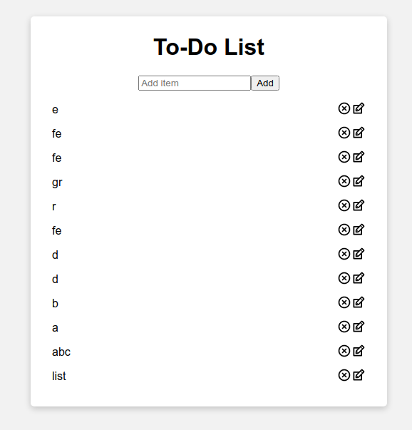

# Introduction
This is a simple To-Do list application following the [Intro to React](https://www.youtube.com/watch?v=E1E08i2UJGI) tutorial. The source repo is [here](https://github.com/briancodex/react-todo-app-v1).

# Setup
1. Clone repo
2. `npm install && npm start`
3. Open `http://localhost:3000`
4. Create a To-Do list

# To-Do (unironically)
- [ ] Implement item "Edit" option
- [ ] Visual redesign
- [ ] Use an actual To-Do storage mechanism (i.e. Database)

# Preview
